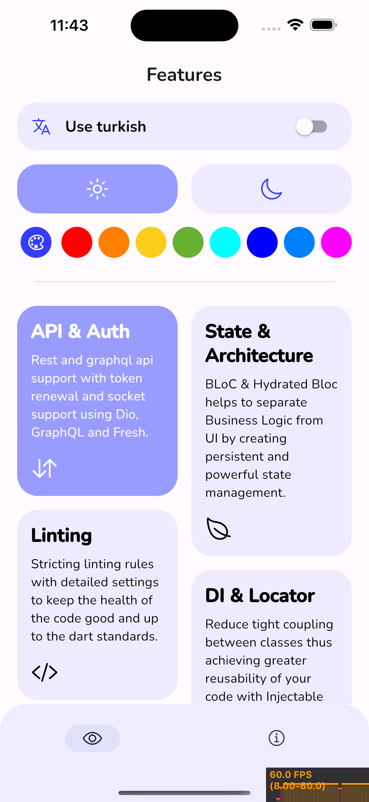
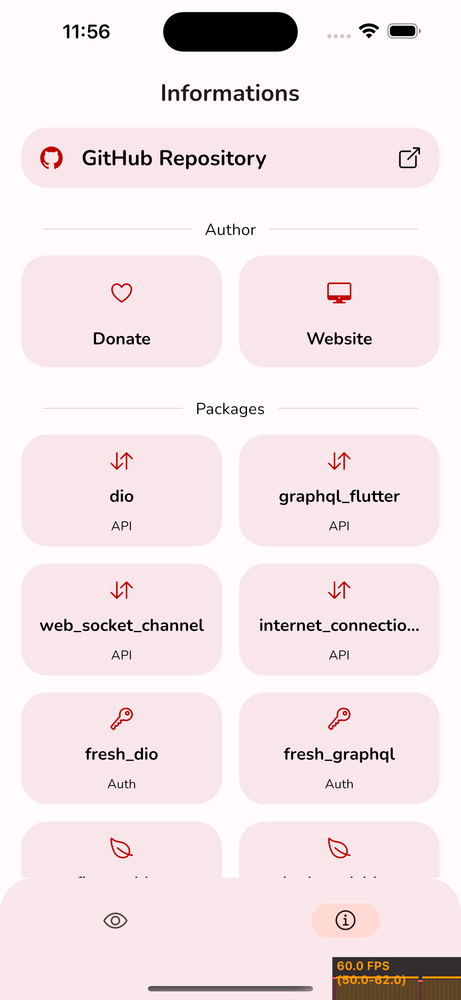
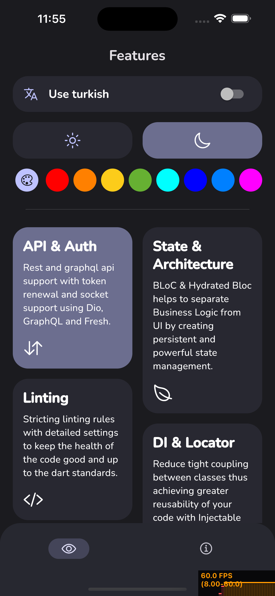
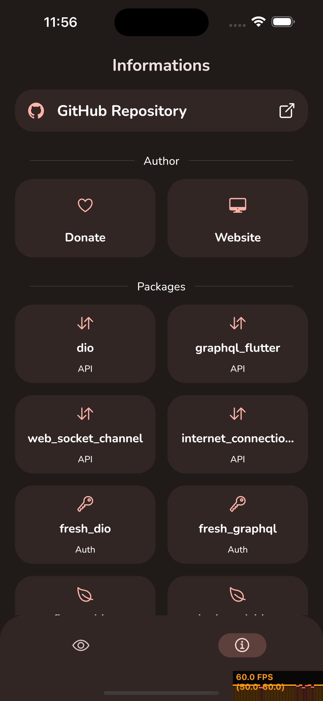

<h1 align="center">
  Flutter Advanced Boilerplate
</h1>

<h4 align="center">A new (almost) fully featured flutter boilerplate project by using <a href="https://pub.dev/packages/flutter_bloc" target="_blank">BLoC</a>.</h4>

<p align="center">
<a href="https://badge.fury.io/js/electron-markdownify">
    
  </a>
<a href="https://badge.fury.io/js/electron-markdownify">
    
  </a>
  <a href="https://badge.fury.io/js/electron-markdownify">
    %3D2.18.2%20<3.0.0-brightgreen.svg">
  </a>
  <a href="https://badge.fury.io/js/electron-markdownify">
    
  </a>


</p>

<p align="center">
  <a href="#memo-the-motivation">The Motivation</a> •
  <a href="#fire-key-features">Key Features</a> •
  <a href="#camera-screenshots">Screenshots</a> •
  <a href="#books-how-to-use">How To Use</a> •
  <a href="#file_folder-folder-structure">Folder Structure</a> •
  <a href="#star2-good-to-know">Good To Know</a> •
  <a href="#package-packages">Packages</a>
</p>

## :memo: The Motivation
There are several reasons why this boilerplate exists, these are in short to create `clear`, `readable`, `reusable`, `scalable`, `testable`, `performant` and `maintainable` projects but in long:
 1. to allow people to deploy `production-grade MVP products`,
 2. to make sure that I `keep everything stupid simple` (*controversial but I tried my best*),
 3. to ensure that project can `easily scale horizontally` as application grows,
 4. to `save developers time` by `reducing boilerplate code` by writing less and generating more,
 5. to `maintain code quality and platform standards` in team projects with strictly linting rules.

## :fire: Key Features

* `API System & Authentication`<br>
Rest and graphql api support with token renewal and socket support using Dio, GraphQL and Fresh.
* `State Management & Architecture`<br>
BLoC & Hydrated Bloc helps to separate Business Logic from UI by creating persistent and powerful state management.
* `Advanced Linting`<br>
Linting rules with detailed settings to keep the health of the code good and up to the dart standards.
* `Dependency Injection & Service Locator`<br>
Reduce tight coupling between classes thus achieving greater reusability of your code with Injectable and GetIt.
* `Code Generation`<br>
Maximize productivity and improve code quality by generating data classes with Freezed, Artemis and Build Runner.
* `Easy & Clean Routing`<br>
AutoRouter allows for strongly-typed arguments passing, effortless deep-linking and code generation to simplify routes & reduce code boilerplate.
* `Desing Pattern`<br>
Repository design pattern reduces the complexity of data layer, isolate unstructured data from the rest of the app and organizes project structure.
* `Exception Handling`<br>
It is not a very ideal solution to handle exceptions using try and catch at every function, Data Channel provides utility for handling exceptions and data routing.
* `Encrypted Storage`<br>
Blazing fast and encrypted key-value database written in pure Dart with Hive and Secure Storage.
* `Dynamic Theme`<br>
With Android 12 and Material You, wallpaper colors can be extracted to create a ColorScheme that can be used to color the app.
* `Localization`<br>
Easily localize the app into other languages with the support of variable keys by simply creating jsons to auto generate language files without requiring context.
* `Logging & Tracking`<br>
A detailed logging and error tracking mechanism to monitor every action taking place in the application in real time with Logging and Sentry.
* `Native Splash`<br>
Flutter Native Splash automatically generates iOS, Android, and Web-native code for customizing this native splash screen background color and splash image.
* `Refresh Rate`<br>
Support for high refresh rate displays with the flutter displaymode package.

## :camera: Screenshots
#### Light Dynamic Theme
| Features Light | Informations Light |
| ------ | ------ |
|  |  |
#### Dark Dynamic Theme
| Features Dark | Informations Dark |
| ------ | ------ |
|  |  |

## :books: How To Use

### :hammer: Build
To clone and run this boilerplate, you'll need [Git](https://git-scm.com) and [Flutter](https://docs.flutter.dev/get-started/install) installed on your computer. From your command line:

```bash
# Clone this repository
$ git clone https://github.com/fikretsengul/flutter_advanced_boilerplate

# Go into the repository
$ cd flutter_advanced_boilerplate

# Install dependencies
$ flutter pub get

# Generate data classes
$ flutter packages pub run build_runner build --delete-conflicting-outputs

# Run the app
$ flutter run
```
### Hide Generated Files
In-order to hide generated files, navigate to `'VSCode'` -> `'Preferences'` -> `'Settings'` and search for `'Files: Exclude'` and add the following patterns by pressing `'Add Pattern'` button:

```
**/*.config.dart
**/*.freezed.dart
**/*.inject.summary
**/*.inject.dart
**/*.g.dart
**/*.gr.dart
```
In Android Studio, navigate to `'Android Studio'` -> `'Preferences'` -> `'Editor'` -> `'File Types'` and paste the below lines under ignore files and folders section:
```
*.config.dart;*.freezed.dart;*.inject.summary;*.inject.dart;*.g.dart;*.gr.dart;
```
## :file_folder: Folder Structure

### Assets Folder
`assets` folder is located above the lib folder. The assets that is used in the application, environmental settings, fonts, images, translations and more are found here.
```
.
└── assets
	├── animations							-> put your animated files here eg. lottie
	├── configs							-> put your env files here
	│ ├── dev.json								-> env that is used for dev
	│ ├── prod.json								-> env that is used for prod
	│ └── test.json								-> env that is used for tes
	├── fonts							-> put your custom font files here
	├── images							-> put your image files here
	└── translations						-> put your translation files here
		├── en.json
		└── tr.json
```

### Features Folder
The `features` folder, which is the backbone of the application, was designed using the ***feature-first structure*** instead of layer-first because it doesn't scale very well as the app grows and ***repository design pattern***. The feature-first approach demands that we create a new folder for every new feature that we add to our app. And inside that folder, we can add the repository pattern layers themselves as sub-folders.
```
.
└── lib
	└── features							-> stands for FEATURE FIRST STRUCTURE
		└── feature_x							-> seperate and put your features here
			├── blocs					-> stands for APPLICATION LAYER
			│ ├── x_cubit.dart					-> seperate and put your logics here
			│ └── x_state.dart
			└── models					-> stands for DOMAIN LAYER
				├── x_model.dart				-> seperate and put your models here
			└── networking					-> stands for DATA LAYER
				├── x_repository.dart				-> seperate and put your repos here
			│ └── widgets					-> stands for PRESENTATION LAYER
				├── x_header_widget.dart			-> seperate and put your widgets here
			└── x_screen.dart
```

### Modules Folder
In the `modules` folder, there are dependency injection registration and initialization processes of third-party modules to ensure that they can be easily accessed and used from within the application.
```
.
└── lib
	└── modules
		├── dependency_injection				-> add your modules injection here
		│ ├── di.dart							-> must initialize di first
		│ └── x_module_di.dart						-> example module injection
		└── x_module						-> create folder for your modules
			└── init_x.dart						-> create initialization files here
```
### Theme Folder
The `theme` folder contains the necessary theme configuration and settings.
```
.
└── lib
	└── theme
		├── text
		│ └── typography.dart
		└── app_theme_creator.dart				-> theme creation configuration here
```
### Utils Folder
Apart from the above, constants, helper classes and methods, shortcuts and many more used throughout the application are located in `utils` folder.
```
.
└── lib
	└── utils
		├── helpers						-> put your helpers here
		│ └── bar_helper.dart						-> example bar helper to show alert
		├── methods						-> put your methods here
		│ └── aliases.dart						-> create alias variables here
		│ └── shorcuts.dart						-> add shortcut methods here
		├── constants.dart					-> configure app constants here
		├── navigation.dart					-> add navigation destinations here
		├── palette.dart					-> define colors here
		└── router.dart						-> add new screens here
```
## :star2: Good To Know
### Resources I Highly Recommend you to Read & Watch
 1. Code with Andrea Tutorials • [Blog](https://codewithandrea.com/tutorials/) • [YouTube](https://www.youtube.com/c/CodeWithAndrea/videos)
 2. Reso Coder Tutorials • [Blog](https://resocoder.com/blog/) • [YouTube](https://www.youtube.com/c/ResoCoder/videos)
 3. Flutter • [YouTube](https://www.youtube.com/c/flutterdev/videos)
 4. Marcus Ng • [YouTube](https://www.youtube.com/c/MarcusNg/videos)
 5. Flutter Mapp • [YouTube](https://www.youtube.com/c/MarcusNg/videos)

### VSCode Extensions
| Extension | Usage |
| ------ | ------ |
| Awesome Flutter Snippets | Awesome Flutter Snippets is a collection of commonly used Flutter classes and methods. It increases your speed of development by eliminating most of the boilerplate code associated with creating a widget.
| Better Comments | The Better Comments extension will help you create more human-friendly comments in your code.
| bloc | VSCode support for the Bloc Library and provides tools for effectively creating Blocs and Cubits for both Flutter and AngularDart apps.
| Build Runner | Run build_runner commands conveniently using VSCode.
| Dart | Dart Code extends VSCode with support for the Dart programming language, and provides tools for effectively editing, refactoring, running, and reloading Flutter mobile apps.
| Error Lens | ErrorLens turbo-charges language diagnostic features by making diagnostics stand out more prominently, highlighting the entire line wherever a diagnostic is generated by the language and also prints the message inline.
| Fluent Icons | Product icons themes allow theme authors to customize the icons used in VS Code's built-in views: all icons except file icons (covered by file icon themes) and icons contributed by extensions.
| Flutter | This VS Code extension adds support for effectively editing, refactoring, running, and reloading Flutter mobile apps. It depends on (and will automatically install) the Dart extension for support for the Dart programming language.
| flutter-stylizer | Flutter Stylizer is a VSCode extension that organizes your Flutter classes in an opinionated and consistent manner.
| GitLens — Git supercharged | GitLens supercharges Git inside VS Code and unlocks untapped knowledge within each repository. It helps you to visualize code authorship at a glance via Git blame annotations and CodeLens, seamlessly navigate and explore Git repositories, gain valuable insights via rich visualizations and powerful comparison commands, and so much more.
| Min Theme | A minimal theme for VS Code that comes in dark and light.
| Output Colorizer | Language extension for VSCode/Bluemix Code that adds syntax colorization for both the output/debug/extensions panel and *.log files.
| Pubspec Assist | Pubspec Assist is a Visual Studio Code extension that allows you to easily add dependencies to your Dart and Flutter project's pubspec.yaml, all without leaving your editor.
| Rainbow Brackets | Provide rainbow colors for the round brackets, the square brackets and the squiggly brackets. This is particularly useful for Lisp or Clojure programmers, and of course, JavaScript, and other programmers.
| Settings Sync | Synchronize Settings, Snippets, Themes, File Icons, Launch, Keybindings, Workspaces and Extensions Across Multiple Machines Using GitHub Gist.
| Sort lines | Sort lines of text in Visual Studio Code.
| Terminal | Run terminal command directly in Text Editor
| Thunder Client | Thunder Client is a lightweight Rest API Client Extension for Visual Studio Code, hand-crafted by Ranga Vadhineni with simple and clean design.
| Version Lens | This extension shows version information when opening a package or project.

## :package: Packages
This repository makes use of the following pub packages:
| Package | Version | Usage |
| ------ | ------ | ------ |
| [dio](https://pub.dev/packages/dio/versions/4.0.6) | ^4.0.6 | API*
| [graphql_flutter](https://pub.dev/packages/graphql_flutter/versions/5.1.0) | ^5.1.0 | API*
| [web_socket_channel](https://pub.dev/packages/web_socket_channel/versions/2.2.0) | ^2.2.0 | API
| [internet_connection_checker](https://pub.dev/packages/internet_connection_checker/versions/1.0.0+1) | ^1.0.0+1 | Network
| [fresh_dio](https://pub.dev/packages/fresh_dio/versions/0.3.2) | ^0.3.2 | Auth*
| [fresh_graphql](https://pub.dev/packages/fresh_graphql/versions/0.5.2) | ^0.5.2 | Auth*
| [flutter_bloc](https://pub.dev/packages/flutter_bloc/versions/8.1.1) | ^8.1.1 | State & Architecture*
| [hydrated_bloc](https://pub.dev/packages/hydrated_bloc/versions/8.1.0) | ^8.1.0 | State Persistance*
| [very_good_analysis](https://pub.dev/packages/very_good_analysis/versions/3.1.0) | ^3.1.0 | Linting*
| [dart_code_metrics](https://pub.dev/packages/dart_code_metrics/versions/4.21.2) | ^4.21.2 | Linting*
| [injectable](https://pub.dev/packages/injectable/versions/1.5.3) | ^1.5.3 | Dependency Injection*
| [get_it](https://pub.dev/packages/get_it/versions/7.2.0) | ^7.2.0 | Service Locator*
| [freezed](https://pub.dev/packages/freezed/versions/2.2.0) | ^2.2.0 | Code Generation for Classes*
| [artemis](https://pub.dev/packages/artemis/versions/6.18.4) | ^6.18.4 | Code Generation for GraphQL*
| [build_runner](https://pub.dev/packages/build_runner/versions/2.3.2) | ^2.3.2 | Code Generation for Others*
| [json_serializable](https://pub.dev/packages/json_serializable/versions/6.5.3) | ^6.5.3 | Code Generation for JSON*
| [auto_route](https://pub.dev/packages/auto_route/versions/5.0.22) | ^5.0.22 | Routing*
| [data_channel](https://pub.dev/packages/data_channel/versions/2.0.0+1) | ^2.0.0+1 | Exceptions*
| [hive_flutter](https://pub.dev/packages/hive_flutter/versions/1.1.0) | ^1.1.0 | Storage*
| [flutter_secure_storage](https://pub.dev/packages/flutter_secure_storage/versions/6.0.0) | ^6.0.0 | Storage*
| [adaptive_theme](https://pub.dev/packages/adaptive_theme/versions/3.1.1) | ^3.1.1 | Theme
| [easy_localization](https://pub.dev/packages/easy_localization/versions/3.0.1) | ^3.0.1 | Localization*
| [logger](https://pub.dev/packages/logger/versions/1.1.0) | ^1.1.0 | Logging*
| [pretty_dio_logger](https://pub.dev/packages/pretty_dio_logger/versions/1.2.0-beta-1) | ^1.2.0-beta-1 | Logging*
| [sentry_flutter](https://pub.dev/packages/sentry_flutter/versions/6.13.1) | ^6.13.1 | Tracking*
| [sentry_dart_plugin](https://pub.dev/packages/sentry_dart_plugin/versions/1.0.0-beta.4) | ^1.0.0-beta.4 | Tracking*
| [sentry_dio](https://pub.dev/packages/sentry_dio/versions/6.13.1) | ^6.13.1 | Tracking*
| [statsfl](https://pub.dev/packages/statsfl/versions/2.3.0) | ^2.3.0 | Tracking
| [flutter_displaymode](https://pub.dev/packages/flutter_displaymode/versions/0.4.0) | ^0.4.0 | Refresh Rate
| [animations](https://pub.dev/packages/animations/versions/2.0.7) | ^2.0.7 | Animations
| [ionicons](https://pub.dev/packages/ionicons/versions/0.2.1) | ^0.2.1 | Icons
| [flutter_staggered_grid_view](https://pub.dev/packages/flutter_staggered_grid_view/versions/0.6.2) | ^0.6.2 | Others
| [custom_sliding_segmented_control](https://pub.dev/packages/custom_sliding_segmented_control/versions/1.7.3) | ^1.7.3 | Others
| [url_launcher](https://pub.dev/packages/url_launcher/versions/6.1.6) | ^6.1.6 | Others
> *Recommended to keep regardless of your project.

## :cherry_blossom: Community
### :fire: Contribution
If you want to say **thank you** you can;
-   add a  [GitHub Star]([https://github.com/create-go-app/cli](https://github.com/fikretsengul/flutter_advanced_boilerplate))  to the project,
-   tweet about project  [on your Twitter](https://twitter.com/),
-   [buy me a coffee](https://www.buymeacoffee.com/iamfikretB)

Also code contributions are always welcome and appreciated.

 1. **Report a bug**
If you think you have encountered a bug, and I should know about it, feel free to report it and I will take care of it.
 2. **Request a feature**
You can also request for a feature, and if it will viable, it will be picked for development.
 3. **Create a pull request**
It can't get better then this, your pull request will be appreciated by the community. You can get started by
    picking up any open issues and make a pull request.

 > If you are new to open-source, make sure to check read more about it [here](https://www.digitalocean.com/community/tutorial_series/an-introduction-to-open-source) and learn more about creating a pull request [here](https://www.digitalocean.com/community/tutorials/how-to-create-a-pull-request-on-github).

### :cactus: Branches
1.  **`stage`**  is the development branch.
2.  **`master`**  is the production branch.
    
3.  No other permanent branches should be created in the main repository, you can create feature branches but they should get merged with the master.
    

**Steps to work with feature branch**

1.  To start working on a new feature, create a new branch prefixed with  `feat`  and followed by feature name. (ie.  `feat-FEATURE-NAME`)
2.  Once you are done with your changes, you can raise PR.

**Steps to create a pull request**

1.  Make a PR to  `stage`  branch.
2.  Comply with the best practices and guidelines e.g. where the PR concerns visual elements it should have an image showing the effect.
3.  It must pass all continuous integration checks and get positive reviews.

After this, changes will be merged.

Together, we can make this project **better** every day! 😘

## :lock: License
MIT © [Fikret Şengül](https://github.com/fikretsengul)
